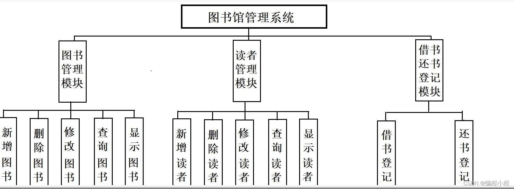

# c语言期末大作业——图书管理系统


具体结构如下




book和reader模块： 

0.关于`init`：

{

首先通过`file_open`打开文件，并且返回文件指针`fp`，再调用`Books_number(fp)` 来返回读者或者书本的数量，再以这个数量来创建一个指定长度的结构体数组，再通过`put_book(books_number,fp,books);`

以`fscanf`的方式，来读取文本中指定格式的数据，把书本的信息放入数组。

`fscanf(fp,"%d %s %s",&books[i].id,&books[i].writer,&books[i].name);）`


在`Books_number(fp`)中，通过`feof(fp)`来判断文件指针是否走到最后一行，走到最后一行时，`feof（fp）`返回true ，从而统计文件的函数，也就是书本的数量

}


1.`add_book()` 新建结构体来存放信息，id由 最后原本书的id 或人的id 加上 1 得到，修改成功返回1 修改不成功返回 0，回到switch结构 退出图书或读者模块 ，自动重进，再次打开文件，读入数据，刷新数据,对于长度过长的数据采取return 0；

2.`delete_book()` 通过输入的信息进行遍历，找到匹配的结构体，记录下他们在数组中的索引，把这些索引放在一个`will_delete[10]`数组中（最多一次性删除十个匹配结果），并记录下要删除的数量，再调用`open_delete_book(或reader)(.....)` 来将除了要删除的结构体 之外的结构体以w模式覆盖写入文件，使得要删除的结构体消失，退出删除函数后，回到`switch`结构，退出图书或读者模块 ，自动重进，再次打开文件，读入数据，刷新数据

3.`modify_book` 通过 id找到指定的结构体，并对相关数据进行修改，再调用上面的`open_delete_book(或reader)(.....)` 来将更新后的数据以w模式覆盖写入文件，退出后无需重新加载，因为结构体中的数据均已更新

4.查询模块  通过对输入的相关信息来进行遍历判断，如果存在则打印出来，不存在则打印无，此外对于字符串的比较需要调用字符串函数`strcmp（）`，在通过id查询时，因为id是唯一的，在查询到符合结果的结构体时，需要返回结构体在数组中的索引以便以后使用，如果不存在则返回-1，表示查无此人

5.展示模块  输入开始的序号 和结束序号 ，可以查询文件中相关行数的书本或读者，需要对开始序号和结束需要进行判断 `（start>end||end>books_number||start<=0）`这些条件都不能成立，否则退出模块


借还模块：

1.main：创建链表的head，通过file_open（以a+的模式打开，方便在末尾添加数据） 分别打开 return 和borrow文件，返回文件指针 ，再分别初始化书本和读者的数据，加载books和readers两个结构体数组，方法与上文描述一致

2.init：初始化时，需要对打开的文件以`fscanf`的方式读入数据到结构体，即

```
if( fscanf(fp,"%s %d %s %s %d %s %s",
           &q->time,
           &q->reader.id,
           &q->reader.name,
           &q->reader.sex,
           &q->book.id,
           &q->book.writer,
           &q->book.name) == EOF)
```

当`fscanf`返回值为EOF时，即可判断出文件读到了最后一行，链表加载完毕

3.展示借还记录：对结构体进行遍历打印

```c
for (Borrow *p= head->next; p !=NULL; p= p->next) {
    printf("借书时间：%s 借书人：%d %s %s 所借书：%d %s %s\n",
           p->time,
           p->reader.id,
           p->reader.name,
           p->reader.sex,
           p->book.id,
           p->book.writer,
           p->book.name);
}
```

当p为NULL时，表示走到了链表的末尾

4.register：`malloc`申请内存，调用 

`int index_reader = Search_byreaderid(readers_number,readers);`来查找读者，返回读者在数组中的索引，`index_reader == -1`时因为没查找到读者退出，再调用`int index_book = query_byid(books_number,books);` 同理，最终将链表节点中的book 和reader 按照索引进行赋值即可 `q->reader = readers[index_reader]; q->book = books[index_book];`  再调用 `createTime(q->time);`来获取当前的时刻，最后将新建的结构体连接在链表的末尾，最最后，通过

```c
fprintf(fp,"%s %d %s %s %d %s %s\n",q->time,
        q->reader.id,
        q->reader.name,
        q->reader.sex,
        q->book.id,
        q->book.writer,
        q->book.name);
```

往文件中添加数据

5.creatime：`time_t raw_time;`创建一个存放时间戳的变量，`time_t`,应该时`time.h`中的自定义类型，

```c
time(&raw_time);调用此函数来获得时间，传入raw_time的地址，将时间戳的值，赋值给raw_time
```

```c
// 将时间戳转换为本地时间
time_info = localtime(&raw_time);
```

```c
strftime(time_str, 20, "%Y-%m-%d-%H:%M:%S", time_info);
```

转化为固定的格式，并存放在指针变量`time_str`中

6.close：释放链表内存，防止内存泄漏，`malloc`申请的内存需要程序猿来手动释放

```
 Borrow *q = NULL;
    for (Borrow *p = bhead; p!=NULL; q=p,p=p->next) {
        free(q);
    }
    free(q);

    Borrow *t = NULL;
    for (Return *p = rhead; p!=NULL; q=t,p=p->next) {
        free(q);
    }

    free(t);
```

q保存了上一个节点的地址，`free`释放q的内存，p则一直向链表的末尾前进，直到`p==NULL`，

最后释放 p为NULL时，p的上一个节点，即最后一个节点
